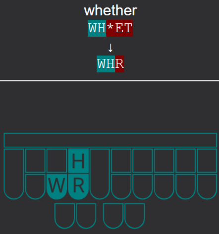

# steno-anki

A collection of shared Anki decks contributed by the community for those learning stenograpy. The repository also contains the backing Python script used to generate the Anki decks from text files.

    

## Community Decks
|Name|Contributor|Description|
|-|-|-|
|learn_plover|rchern|A sub-deck per lesson from the [Learn Plover!](https://sites.google.com/site/learnplover/) site.

## Deck Usage

Community provided shared decks can be downloaded from the [releases](https://github.com/rchern/steno-anki/releases) page. In the assets for a release, download the desired .apkg package(s) and import into Anki.

**It is strongly recommended that you export your decks (as an .apkg file, with scheduling and media included) prior to importing.**

## Deck Files

Deck files contain 2 type of lines:
|Type|Syntax|Example|
|-|-|-|
|Title|Title~~~Id|<pre>Left + Vowel + Right~~~LVR</pre>|
|Entry|Translation(tab)Outline|<pre>cat&#9;KAT</pre>|

Anki requires decks to have a unique numerical id. Make sure that the Id used is not used by any other decks in the project. The Id in the Title row should be kept to 8 characters or less to support the numerical conversion.

Anki sub-decks are created by using `::` in the title. `Learn Plover::Lesson 1` will generate a `Learn Plover` deck with a `Lesson 1` deck nested underneath.

Entries should be separated from their outline by the tab character. Do not use space(s).

Blank lines and lines that begin with a `#` will be ignored.

Multiple decks may be listed in the same file. Files grouped into the same folder will be combined into a single deck. Only top-level deck files and folders will be processed. Nested folders will be ignored.

## Script Usage

Run `main.py` with using the following command line options:

|Name|Flag|Default|Description|
|:-:|:-:|:-:|:-|
|input|i|decks|Folder containing the deck files.|
|output|o|dist|Folder for the generated Anki deck packages.|

## Referenced Projects

The generated decks use the [Steno-Font](https://github.com/Kaoffie/steno_font) to display the steno layout for outlines. The font is embedded in the generated decks and does not need to be installed separately. This is done so the deck can be synced to the web or mobile apps and still display correctly.

## Contributing

Additional decks that would be of value to the community are absolutely welcome as PRs! General script updates are also welcome.

## Contact

rchern on the Plover Discord.